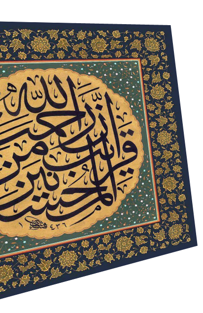
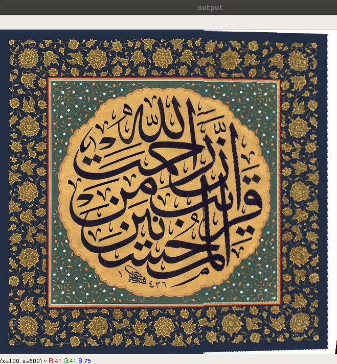
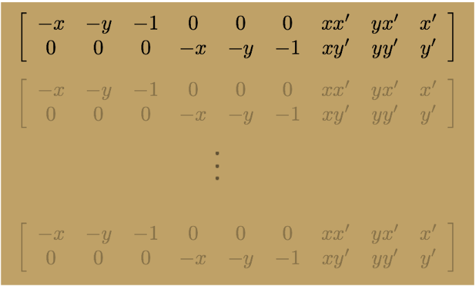

# Image Stitching

Using image warping and homographies, an image mosaic is created.

## Getting started

### Prerequisites

To run this appliction. You need to install python, cv2 and numpy

### Running a test case

1. Run main.py using the command
   ```
   python main.py
   ```
2. Two images will show up. Use the mouse to define correspondences. Click on any pixel in the first image then click on the corresponding pixel on the second image. You have to define at least 4 correspondences (8 clicks). The more pixels you define, the more accurate result you will get
3. Press any key and wait until the output image appears (this may take a while).
4. Press any key to close the output image.

### Using your own image

To use other images:

1. copy the images you want to the current directory.
2. Change main.py lines 6 and 7 to the new image names

## Sample Runs

### Input images




### Output image



## How it works

### Getting correspondences <br>

Using cv2 MouseCallback, all mouse clicks are stored in two lists: `imgClicks1` and `imgClicks2`. These lists are used to compute the homography matrix. This step is done in main.py

### Computing the homography matrix <br>

1.Matrix A is computed by stacking together constraints from multiple correspondences as follows:
A = 
(Image credits: cmu slides http://www.cs.cmu.edu/~16385/) <br>
where xi and yi stand for the coordinates of mouse clicks in the right images, xi\` and yi\` stand for the corresponding coordinates of mouse clicks in the second image. <br> <br>

2. To compute the h vector, we computed the SVD of A. <br> A was decomposed into three matrices: U, S and V <br> <br>
3. The vector corresponding to the smallest eigenvalue was stored and reshaped into a 3\*3 matrix forming H, the homography matrix.

### Warping Between Image Planes

There are two ways to warp the right images: warping and inverse warping.

We know that the computed H can map any homogeneous coordinates in the left image to their correspondings in the right one using the formula:

p\` = H.p

But using the forward warping, there will be holes in the warped image.
Instead of the forward warping, we used inverse warping, in which the formula is:

p = inv(H). p\`

Rather than using the coordinates of the original image and storing their values in the computed p\`, we go over each pixel in the warped image (p\`), compute their original coordinates in the original image and store the value in p\`.

### Creating the Output

The final step is concatenating both the left image and warped right image in one image. The output is the image mosaic.
